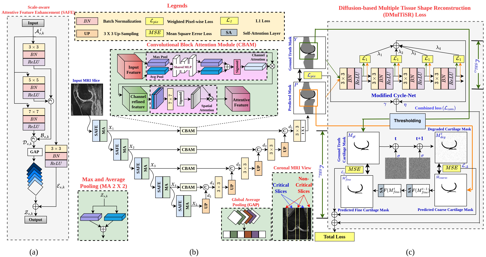

This repo contains the Official Pytorch implementation of our paper at ICIP'25:

Diffusion Based Shape-Aware Learning With Multi-Resolution Context For Segmentation of Tibiofemoral Knee Joint Tissues: An End-To-End Approach
by Akshay Daydar*, Alik Pramanick, Arijit Sur, Subramani Kanagaraj

 Figure: Overall schematic of the proposed Multi-Scale Attentive-Unet with (a) Scale-aware Attentive Feature Enhancement
Module, and (c) the total loss function (Pixel-wise and Proposed Diffusion-based Multi Tissue Shape Reconstruction).

Requirements

    Linux
    Python3 3.8.10
    Pytorch 1.13.1
    train and test with A100 GPU

Prepare Dataset:

    1. Download Knee MRI Dataset from OAI repository at https://nda.nih.gov/oai and corresponding masks from OAI-ZIB repository at pubdata.zib.de
    2. Convert the downloaded dicom image files and .mhd mask files to png file format.
    3. Optional: Rename the all files to SubjectID_Imagenumber file format for better coding clearity and results comparison.
    4. Save the preprocessed dataset to "Data2" folder. Within this folder independent "Training" and "Testing" folders need to be made following the image ID provided in "train_test_images.csv" file. 

Training and Testing:

Prepare the dataset and then run the following command for training:

    python3 train.py

For Testing, run

    python3 test.py

Citation:
 If you find this repo useful for your research, please consider citing our paper:

    A. Daydar, A. Pramanick, A. Sur and S. Kanagaraj, "Diffusion Based Shape-Aware Learning with Multi-Scale Context for Segmentation of Tibiofemoral Knee Joint Tissues: an End-to-End Approach," 2025 IEEE International Conference on Image Processing (ICIP), Anchorage, AK, USA, 2025, pp. 1834-1839, doi: 10.1109/ICIP55913.2025.11084369.
